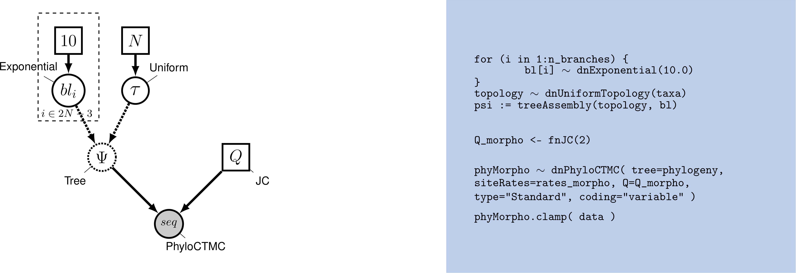

# Introduction

While molecular data have become the default for building phylogenetic
trees for many types of evolutionary analysis, morphological data
remains important, particularly for analyses involving fossils. The use
of morphological data raises special considerations for model-based
methods for phylogenetic inference. Morphological data are typically
collected to maximize the number of parsimony-informative characters -
that is, the characters that provide information in favor of one
topology over another. Morphological characters also do not carry common
meanings from one character in a matrix to the next; character codings
are made arbitrarily. These two factors require extensions to our
existing phylogenetic models. Accounting for the complexity of
morphological characters remains challenging. This tutorial will provide
a discussion of modeling morphological characters, and will demonstrate
how to perform Bayesian phylogenetic analysis with morphology using
RevBayes \cite{Hoehna2016b}.


## Overview of Discrete Morphology Models

 
_Graphical model showing the Mk model (left panel)._ 
_Rev code specifying the Mk model is on the right-hand panel._

Molecular data forms the basis of most phylogenetic analyses today.
However, morphological characters remain relevant: Fossils often provide
our only direct observation of extinct biodiversity; DNA degradation can
make it difficult or impossible to obtain sufficient molecular data from
fragile museum specimens. Using morphological data can help researchers
include specimens in their phylogeny that might be left out of a
molecular tree.

To understand how morphological characters are modeled, it is important
to understand how characters are collected. Unlike in molecular data,
for which homology is algorithmically determined, homology in a
character is typically assessed by an expert. Biologists will typically
decide what characters are homologous by looking across specimens at the
same structure in multiple taxa; they may also look at the developmental
origin of structures in making this assessment \cite{Phillips06}. Once
homology is determined, characters are broken down into states, or
different forms a single character can take. The state `0` commonly
refers to absence, meaning that character is not present. In some
codings, absence will mean that character has not evolved in that group.
In others, absence means that that character has not evolved in that
group, and/or that that character has been lost in that group
\cite{freudenstein05}. This type of coding is arbitrary, but both
*non-random* and *meaningful*, and poses challenges for how we model
the data.

Historically, most phylogenetic analyses using morphological characters
have been performed using the maximum parsimony optimality criterion.
Maximum parsimony analysis involves proposing trees from the
morphological data. Each tree is evaluated according to how many changes
it implied in the data, and the tree that requires the fewest changes is
preferred. In this way of estimating a tree, a character that does not
change, or changes only in one taxon, cannot be used to discriminate
between trees (i.e., it does not favor a topology). Therefore, workers
with parsimony typically do not collect characters that are parsimony
uninformative.

In 2001, Paul Lewis \cite{Lewis2001} introduced a generalization of the
Jukes-Cantor model of sequence evolution for use with morphological
data. This model, called the Mk (Markov model, assuming each character
is in one of *k* states) model provided a mathematical formulation that
could be used to estimate trees from morphological data in both
likelihood and Bayesian frameworks. While this model is a useful step
forward, as a generalization of the Jukes-Cantor, it still makes fairly
simplistic assumptions. This tutorial will guide you through estimating
a phylogeny with the Mk model, and two useful extensions to the model.


## The Mk Model 

The Mk model is a generalization of the Jukes-Cantor model of nucleotide
sequence evolution, which we discussed in the [CTMC](https://revbayes.github.io/tutorials/ctmc/) tutorial. 
The Q matrix for a two-state Mk model looks like so:

$$Q = \begin{pmatrix} -\mu_0 & \mu_{01} \\
\mu_{10} & -\mu_1  &\\
\end{pmatrix} \mbox{  ,}$$

This matrix can be expanded to accommodate multi-state data, as well:

$$Q = \begin{pmatrix} -\mu_0 & \mu_{01} & \mu_{02} & \mu_{03} \\
\mu_{10} & -\mu_1  & \mu_{12} & \mu_{13} \\
\mu_{20} & \mu_{21} & -\mu_2  & \mu_{23} \\
\mu_{30} & \mu_{31} & \mu_{32} & -\mu_3 
\end{pmatrix} \mbox{  ,}$$

However, the Mk model sets transitions to be equal from any state to any
other state. In that sense, our multistate matrix really looks like
this:

$$Q = \begin{pmatrix} -(k-1)\mu & \mu & \mu & \mu \\
\mu & -(k-1)\mu  & \mu & \mu \\
\mu & \mu & -(k-1)\mu  & \mu \\
\mu & \mu & \mu & -(k-1)\mu \\
\end{pmatrix} \mbox{  ,}$$

Because this is a Jukes-Cantor-like model \cite{Jukes1969}, state
frequencies do not vary as a model parameter. These assumptions may seem
unrealistic. However, all models are a compromise between reality and
generalizability. Prior work has demonstrated that, in many conditions,
the model does perform adequately \cite{Wright2014}. Because morphological
characters do not carry common meaning across sites in a matrix in the
way that nucleotide characters do, making assumptions that fit all
characters is challenging. A visualization of this simple model can be
seen in above graphical model.

We will first perform a phylogenetic analysis using the Mk model. In
further sections, we will explore how to relax key assumptions of the Mk
model.

## Ascertainment Bias 

When Lewis first introduced the Mk model, he observed that branch
lengths on the trees were greatly inflated. The reason for this is that
when morphological characters are collected, characters that do not
vary, or vary in a non-parsimony-informative way (such as
autapomorphies) are excluded. Excluding these low-rate characters causes
the overall amount of evolution to be over-estimated. This causes an
inflation in the branch lengths \cite{Lewis2001}.

Therefore, when performing a morphological phylogenetic analysis, it is
important to correct for this bias. There are numerous statistically
valid ways to perform this correction \cite{allman08b}. Original corrections
simulated invariant and non-parsimony informative characters along the
proposed tree. The likelihood of these characters would then be
calculated and used to normalize the total likelihood value. RevBayes
implements a dynamic programming approach that calculates the same
likelihood, but does so faster.

### Example: Inferring a Phylogeny of Fossil And Extant Ants Using the Mk Model 

In this example, we will use morphological character data from 41 taxa
of extinct and extant ants (Barden and Grimaldi 2017). The dataset contains 41 binary and multistate characters, a fairly typical dataset size for morphological characters.

**Tutorial Format**

This tutorial follows a specific format for issuing instructions and
information.

>The boxed instructions guide you to complete tasks that are not part of
>the RevBayes syntax, but rather direct you to create directories or
>files or similar.

Information describing the commands and instructions will be written in
paragraph-form before or after they are issued.

All command-line text, including all Rev syntax, are given in
`monotype font`. Furthermore, blocks of Rev code that are needed to
build the model, specify the analysis, or execute the run are given in
separate shaded boxes. For example, we will instruct you to create a
constant node called `example` that is equal to `1.0` using the `<-`
operator like this:


```{r eval=FALSE, include=FALSE}
    example <- 1.0
```

It is important to be aware that some PDF viewers may render some
characters given as differently. Thus, if you copy and paste text from
this PDF, you may introduce some incorrect characters. Because of this,
we recommend that you type the instructions in this tutorial or copy
them from the scripts provided.


**Data and Files**

>On your own computer, there should be a directory called **data**.
>It should contain: [`ants.nex`](data/ants.nex).

**Getting Started**

>Create a new directory (in `4 - April Wright`) called **scripts**.

When you execute RevBayes in this exercise, you will do so within the
main directory  (`4 - April Wright`), thus,
if you are using a Unix-based operating system, we recommend that you
add the RevBayes binary to your path. Alternatively make sure that you set the 
working directory to, for example, **4 - April Wright** if this is 
the directory you stored the scripts and data in.

**Creating Rev Files**

In this exercise, you will work primarily in this R text editor and
create a set of files that will be easily managed and interchanged. 

In this section you will begin the file and write the Rev commands for
loading in the taxon list and managing the data matrices. Then, starting
in section Mk Model, you will move on to specifying each of 
the model components. Once the model specifications are
complete, you will complete the script with the instructions given in section

**Load Data Matrices**

RevBayes uses the function `readDiscreteCharacterData()` to load a
data matrix to the workspace from a formatted file. This function can be
used for both molecular sequences and discrete morphological characters.
Import the morphological character matrix and assign it to the variable
`morpho`. We will be using a matrix of extant and fossil data from Barden and Grimaldi (2017). 


```{r include=FALSE}
    morpho <- readDiscreteCharacterData("data/ants.nex")
```

**Create Helper Variables**

Before we begin writing the Rev scripts for each of the models, 
we need to instantiate a couple “helper variables” that will
be used by downstream parts of our model specification. 

Create a new constant node called `num_taxa` that is equal to the number
of species in our analysis (41) and a constant node called `num_branches` representing
the number of branches in the tree. We will also create a constant node of
the taxon names. This list will be used to initialize the tree.


```{r include=FALSE}
    taxa <- morpho.names()
    num_taxa <- morpho.size() 
    num_branches <- 2 * num_taxa - 2
```

Next, create two workspace variables called `mvi` and `mni`. These variable are 
iterators that will build a vector containing all of the MCMC moves used
to propose new states for every stochastic node in the model graph. Each
time a new move is added to the vector, `mvi` will be incremented by a
value of `1`.


```{r include=FALSE}
    mvi = 1
    mni = 1
```

One important distinction here is that `mvi` is part of the RevBayes
workspace and not the hierarchical model. Thus, we use the workspace
assignment operator `=` instead of the constant node assignment `<-`.


## The Mk Model 

First, we will create a joint prior on the branch lengths and tree topology. 
This should be familiar from the 


```{r include=FALSE}
    br_len_lambda ~ dnExp(0.2)
    moves[mvi++] = mvScale(br_len_lambda, weight=2)

    phylogeny ~ dnUniformTopologyBranchLength(taxa, branchLengthDistribution=dnExponential(br_len_lambda))
    moves[mvi++] = mvNNI(phylogeny, weight=num_branches/2.0)
    moves[mvi++] = mvSPR(phylogeny, weight=num_branches/10.0)
    moves[mvi++] = mvBranchLengthScale(phylogeny, weight=num_branches)
    
    tree_length := phylogeny.treeLength()
```

Next, we will create a $Q$ matrix. Recall that the Mk model is simply a
generalization of the JC model. Therefore, we will create a 2x2 $Q$ matrix
using `fnJC`, which initializes Q-matrices with equal transition
probabilities between all states.


```{r include=FALSE}
    Q_morpho <- fnJC(8)
```

Now that we have the basics of the model specified, we will add
Gamma-distributed rate variation and specify moves on the parameter to
the Gamma distribution.


```{r include=FALSE}
Q_morpho
```

       [ [ -1.0000, 0.1667, 0.1667, 0.1667, 0.1667, 0.1667, 0.1667 ] ,
         0.1667, -1.0000, 0.1667, 0.1667, 0.1667, 0.1667, 0.1667 ] ,
         0.1667, 0.1667, -1.0000, 0.1667, 0.1667, 0.1667, 0.1667 ] ,
         0.1667, 0.1667, 0.1667, -1.0000, 0.1667, 0.1667, 0.1667 ] ,
         0.1667, 0.1667, 0.1667, 0.1667, -1.0000, 0.1667, 0.1667 ] ,
         0.1667, 0.1667, 0.1667, 0.1667, 0.1667, -1.0000, 0.1667 ] ,
         0.1667, 0.1667, 0.1667, 0.1667, 0.1667, 0.1667, -1.0000 ] ]


```{r include=FALSE}
    alpha_morpho ~ dnUniform( 0, 1E6 )
    rates_morpho := fnDiscretizeGamma( alpha_morpho, alpha_morpho, 4 )
    #Moves on the parameters to the Gamma distribution.
    moves[mvi++] = mvScale(alpha_morpho, lambda=1, weight=2.0)
```

Lastly, we set up the CTMC. 

We see some familiar pieces: tree, $Q$ matrix and site_rates.
We also have two new keywords: data type and coding. The data type
argument specifies the type of data - in our case, “Standard”, the
specification for morphology.


```{r include=FALSE}
    phyMorpho ~ dnPhyloCTMC(tree=phylogeny, siteRates=rates_morpho, Q=Q_morpho, type="Standard")
    phyMorpho.clamp(morpho)
```

All of the components of the model are now specified.

### Complete MCMC Analysis

**Create Model Object**

We can now create our workspace model variable with our fully specified
model DAG. We will do this with the `model()` function and provide a
single node in the graph (`phylogeny`).


```{r include=FALSE}
    mymodel = model(phylogeny)
```

The object `mymodel` is a wrapper around the entire model graph and
allows us to pass the model to various functions that are specific to
our MCMC analysis.


**Specify Monitors and Output Filenames**

The next important step for our Rev-script is to specify the
monitors and output file names. For this, we create a vector called
`monitors` that will each sample and record or output our MCMC.

The first monitor we will create will monitor every named random
variable in our model graph. This will include every stochastic and
deterministic node using the `mnModel` monitor. The only parameter that
is not included in the `mnModel` is the tree topology. Therefore, the
parameters in the file written by this monitor are all numerical
parameters written to a tab-separated text file that can be opened by
accessory programs for evaluating such parameters. We will also name the
output file for this monitor and indicate that we wish to sample our
MCMC every 10 cycles.


```{r include=FALSE}
    monitors[mni++] = mnModel(filename="output/mk_gamma.log", printgen=10)
```

The `mnFile` monitor writes any parameter we specify to file. Thus, if
we only cared about the branch lengths and nothing else (this is not a
typical or recommended attitude for an analysis this complex) we
wouldn't use the `mnModel` monitor above and just use the `mnFile`
monitor to write a smaller and simpler output file. Since the tree
topology is not included in the `mnModel` monitor (because it is not
numerical), we will use `mnFile` to write the tree to file by specifying
our `phylogeny` variable in the arguments.


```{r include=FALSE}
    monitors[mni++] = mnFile(filename="output/mk_gamma.trees", printgen=10, phylogeny)
```

The third monitor we will add to our analysis will print information to
the screen. Like with `mnFile` we must tell `mnScreen` which parameters
we'd like to see updated on the screen.


```{r include=FALSE}
    monitors[mni++] = mnScreen(printgen=100)
```

### Set-Up the MCMC

Once we have set up our model, moves, and monitors, we can now create
the workspace variable that defines our MCMC run. We do this using the
`mcmc()` function that simply takes the three main analysis components
as arguments.


```{r include=FALSE}
    mymcmc = mcmc(mymodel, monitors, moves, nruns=2, combine="mixed")
```

The MCMC object that we named `mymcmc` has a member method called
`.run()`. This will execute our analysis and we will set the chain
length to `10000` cycles using the `generations` option.


```{r include=FALSE}
    mymcmc.run(generations=10000, tuningInterval=200)
```

Once our Markov chain has terminated, we will want RevBayes to close.
Tell the program to quit using the `q()` function.


```{r include=FALSE}
    q()
```

## You made it! Save all of your files.



With all the parameters specified and all analysis components in place,
you are now ready to run your analysis. The Rev scripts you just
created will all be used by RevBayes.

>Begin by running the RevBayes executable. In Unix systems, type the
>following in your terminal (if the RevBayes binary is in your path):
>rb

RevBayes cannot run inside the RStudio window. So we will need to copy our code out of RStudio. Luckily, the knitr package makes this very easy. Run the following in the console:

```
library(knitr)
purl("RB_MCMC_Discrete_Morph.md")
```

Provided that you started RevBayes from the correct directory
(`4 - April Wright`), you can then use the `source()`
function to feed RevBayes your Rev-script file (`mk_gamma.Rev`).


```{bash eval=FALSE, include=FALSE}
    source("scripts/mk_gamma.Rev")
```

When the analysis is complete, RevBayes will quit and you will have a
new directory called `output` that will contain all of the files you
specified with the monitors.

#### Lognormally-distributed among-character rate variation

As we discussed, there is reason to believe a lognormal distribution may fit morphological data better than a gamma. RevBayes makes it very natural to discretize _any_ distribution you might like to work with.

```{r eval=FALSE, include=FALSE}

    rates_morpho := fnDiscretizeDistribution( dnLognormal(ln(alpha_morpho), 0.01), 4 )
```

Can you figure out which line you might replace with this code? Do it, and change your output files to indicate that this is estimation uses a lognormal distribution. Re-run your Rev script.


#### Ascertainment Bias

As discussed earlier in the section Ascertainment_Bias, we also need to
correct for ascertainment bias. 

>Create a copy of your previous `Rev` script, and call it *mcmc_Mkv.Rev*. 
>You will need to modify the `Rev`
>code provided in this section in this file.

In `RevBayes` it is actually very simple to add a correction for ascertainment bias. 
You only need to set the option `coding="variable"` in the `dnPhyloCTMC`. Coding specifies 
what type of ascertainment bias is expected. We are using the `variable` correction,
as we have no invariant character in our matrix. If we also lacked
parsimony non-informative characters, we would use the coding `informative`.


```RevBayes
phyMorpho ~ dnPhyloCTMC(tree=phylogeny, siteRates=rates_morpho, Q=Q_morpho, type="Standard", coding="variable")
```

## References


