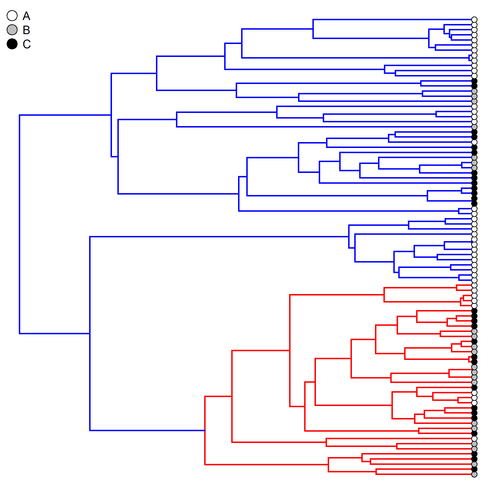
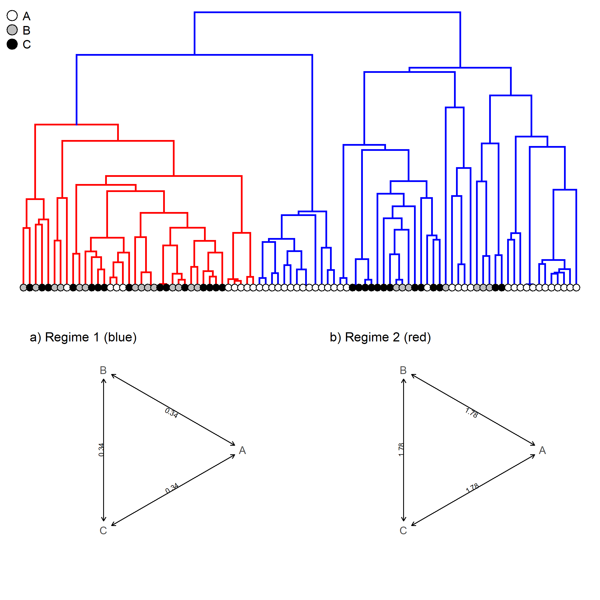
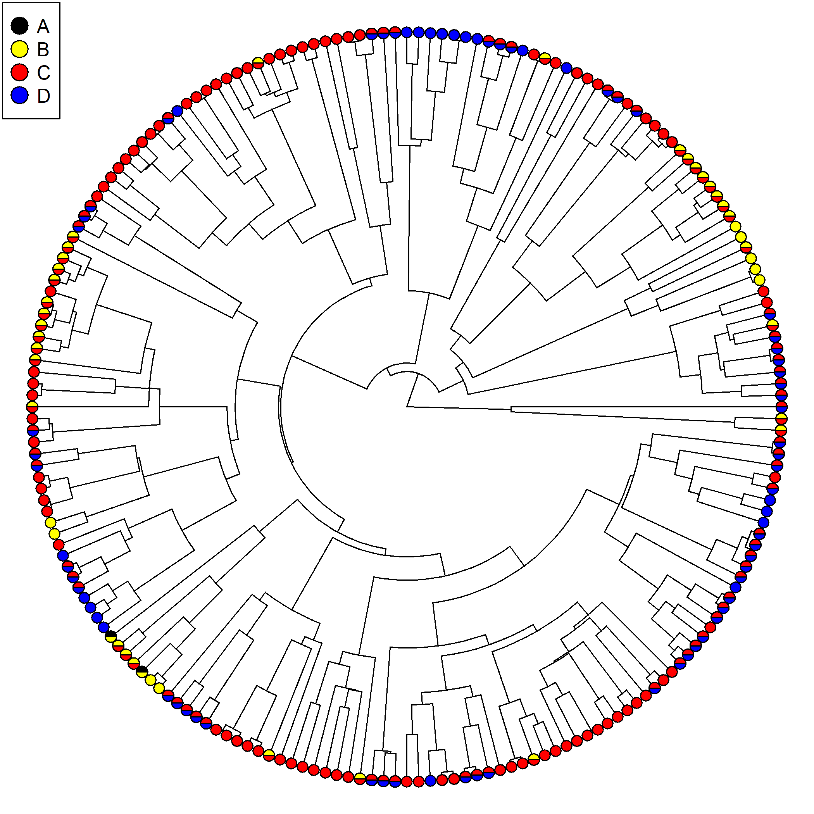
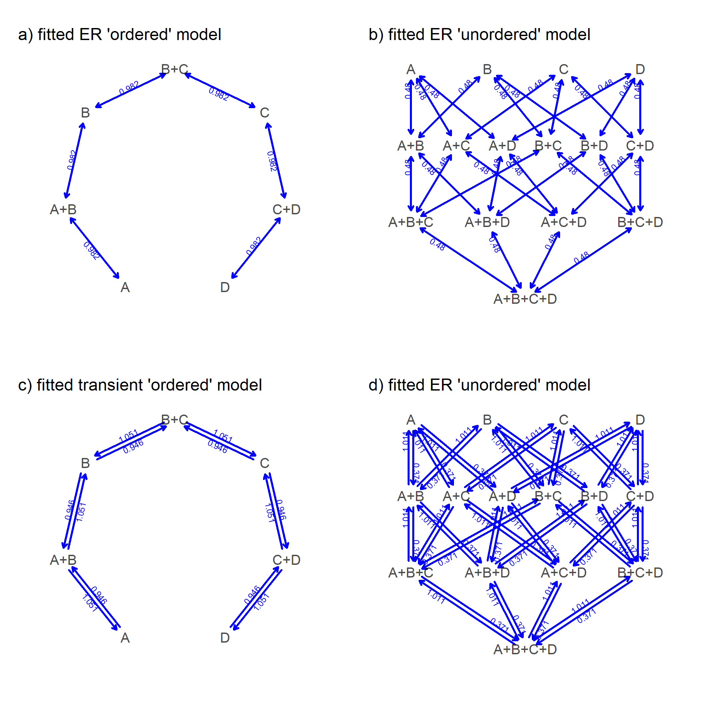
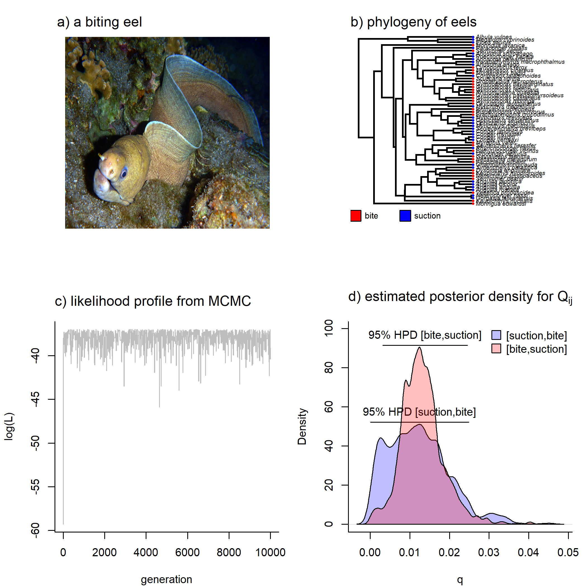

<h2>Some methods for the comparative analysis of discrete character data</h2>


```r
library(phytools)
packageVersion("phytools") ## installed from GitHub 0.6-99 is fine
```

```
## [1] '0.7.0'
```

<h3><i>Method 1</i>: Testing for heterogeneous rates of discrete character 
evolution on phylogenies.</h3>

In this first of three short modules, we'll see how to fit a extended 
M<i>k</i> model in which the rate of character evolution varies as a 
function of 'regimes' mapped onto the tree.

We can do this first using some simulated data that can be downloaded here:

1. <a href="simulated-tree.tre">simulated-tree.tre</a>
2. <a href="simulated-data.csv">simulated-data.csv</a>


```r
sim.tree<-read.tree("simulated-tree.tre")
sim.data<-read.csv("simulated-data.csv",row.names=1)
```

Plot our tree:


```r
plotTree(sim.tree,ftype="off")
nodelabels(cex=0.6)
```


Now let's imagine that we had some <i>a priori</i> reason, independent of our
character data, to suspect that clade descended from node '93' had evolved 
under a different evolution. Let's map this hypothesis on the tree, jointly
with our trait data at the tips:


```r
hypothesis<-paintSubTree(sim.tree,93,
	"regime 2","regime 1")
cols<-setNames(c("blue","red"),c("regime 1","regime 2"))
plot(hypothesis,cols,ftype="off")
trait<-setNames(sim.data[,1],rownames(sim.data))
tiplabels(pie=to.matrix(trait[hypothesis$tip.label],
	levels(trait)),cex=0.3,
	piecol=c("white","grey","black"))
legend("topleft",pch=21,pt.cex=2,
	pt.bg=c("white","grey","black"),
	legend=levels(trait),bty="n")
```



Let's fit two models to the data as follows:


```r
singleRateModel<-fitMk(hypothesis,trait,
	model="ER")
singleRateModel
```

```
## Object of class "fitMk".
## 
## Fitted (or set) value of Q:
##           A         B         C
## A -1.431319  0.715659  0.715659
## B  0.715659 -1.431319  0.715659
## C  0.715659  0.715659 -1.431319
## 
## Fitted (or set) value of pi:
##         A         B         C 
## 0.3333333 0.3333333 0.3333333 
## 
## Log-likelihood: -64.975367 
## 
## Optimization method used was "nlminb"
```

```r
multiRateModel<-fitmultiMk(hypothesis,trait,
	model="ER")
multiRateModel
```

```
## Object of class "fitmultiMk".
## 
## Fitted value of Q[regime 1]:
##           A         B         C
## A -0.689337  0.344668  0.344668
## B  0.344668 -0.689337  0.344668
## C  0.344668  0.344668 -0.689337
## 
## Fitted value of Q[regime 2]:
##           A         B         C
## A -3.560624  1.780312  1.780312
## B  1.780312 -3.560624  1.780312
## C  1.780312  1.780312 -3.560624
## 
## Fitted (or set) value of pi:
##         A         B         C 
## 0.3333333 0.3333333 0.3333333 
## 
## Log-likelihood: -60.517811 
## 
## Optimization method used was "nlminb"
```

These models can be compared directly:


```r
data.frame(model=c("single-rate","multi-rate"),
	logLik=c(logLik(singleRateModel),
	logLik(multiRateModel)),
	k=c(attr(AIC(singleRateModel),"df"),
	attr(AIC(multiRateModel),"df")),
	AIC=c(AIC(singleRateModel),
	AIC(multiRateModel)))
```

```
##         model    logLik k      AIC
## 1 single-rate -64.97537 1 131.9507
## 2  multi-rate -60.51781 2 125.0356
```

This tells us that the multi-rate model is much better supported than the
single rate model.

Let's proceed to plot our best-fitting model as follows:


```r
layout(matrix(c(1,1,2,3),2,2,byrow=TRUE))
plot(hypothesis,cols,ftype="off",
	direction="downwards")
tiplabels(pie=to.matrix(trait[hypothesis$tip.label],
	levels(trait)),cex=0.3,
	piecol=c("white","grey","black"))
legend("topleft",pch=21,pt.cex=2,
	pt.bg=c("white","grey","black"),
	legend=levels(trait),bty="n")
obj<-multiRateModel
obj$rates<-round(obj$rates[1],2)
obj$regimes<-NULL
class(obj)<-"fitMk"
plot(obj,show.zeros=FALSE,
	mar=rep(2.1,4),show.zeros=FALSE,
	tol=1e-3,cex.traits=0.9,
	cex.rates=0.6)
mtext(text="a) Regime 1 (blue)",
    adj=0,line=-1,cex=0.9)

obj<-multiRateModel
obj$rates<-round(obj$rates[2],2)
obj$regimes<-NULL
class(obj)<-"fitMk"
plot(obj,show.zeros=FALSE,
	mar=rep(2.1,4),show.zeros=FALSE,
	tol=1e-3,cex.traits=0.9,
	cex.rates=0.6)
mtext(text="b) Regime 2 (red)",
    adj=0,line=-1,cex=0.9)
```



Now we can try the same thing with a real data set consisting of a phylogeny
of <i>Anolis</i> lizards and  the number of vertebrae in the tail:

1. <a href="VERT.CSV">VERT.CSV</a>
2. <a href="ANOLIS.PHY">ANOLIS.PHY</a>

Start by reading the data from file:


```r
X<-read.csv("VERT.CSV",row.names=1)
vert<-factor(setNames(X[,1],rownames(X)),
	levels=min(X[,1]):max(X[,1]))
```

Now we can create the model that we want to fit. For this step, I propose
an ordered reversible model - in which caudal vertebrae are gained & lost 
sequentially - although possibly with different rates in either direction:


```r
k<-length(levels(vert))
ordered<-matrix(0,k,k,dimnames=list(levels(vert),
	levels(vert)))
for(i in 1:k){
	if(i<k) ordered[i,i+1]<-1
	if(i>1) ordered[i,i-1]<-2
}
ordered[i,i-1]<-2
```

This is the design matrix of our model:


```r
ordered
```

```
##    34 35 36 37 38 39 40 41 42 43 44 45 46 47 48 49 50 51 52 53 54 55
## 34  0  1  0  0  0  0  0  0  0  0  0  0  0  0  0  0  0  0  0  0  0  0
## 35  2  0  1  0  0  0  0  0  0  0  0  0  0  0  0  0  0  0  0  0  0  0
## 36  0  2  0  1  0  0  0  0  0  0  0  0  0  0  0  0  0  0  0  0  0  0
## 37  0  0  2  0  1  0  0  0  0  0  0  0  0  0  0  0  0  0  0  0  0  0
## 38  0  0  0  2  0  1  0  0  0  0  0  0  0  0  0  0  0  0  0  0  0  0
## 39  0  0  0  0  2  0  1  0  0  0  0  0  0  0  0  0  0  0  0  0  0  0
## 40  0  0  0  0  0  2  0  1  0  0  0  0  0  0  0  0  0  0  0  0  0  0
## 41  0  0  0  0  0  0  2  0  1  0  0  0  0  0  0  0  0  0  0  0  0  0
## 42  0  0  0  0  0  0  0  2  0  1  0  0  0  0  0  0  0  0  0  0  0  0
## 43  0  0  0  0  0  0  0  0  2  0  1  0  0  0  0  0  0  0  0  0  0  0
## 44  0  0  0  0  0  0  0  0  0  2  0  1  0  0  0  0  0  0  0  0  0  0
## 45  0  0  0  0  0  0  0  0  0  0  2  0  1  0  0  0  0  0  0  0  0  0
## 46  0  0  0  0  0  0  0  0  0  0  0  2  0  1  0  0  0  0  0  0  0  0
## 47  0  0  0  0  0  0  0  0  0  0  0  0  2  0  1  0  0  0  0  0  0  0
## 48  0  0  0  0  0  0  0  0  0  0  0  0  0  2  0  1  0  0  0  0  0  0
## 49  0  0  0  0  0  0  0  0  0  0  0  0  0  0  2  0  1  0  0  0  0  0
## 50  0  0  0  0  0  0  0  0  0  0  0  0  0  0  0  2  0  1  0  0  0  0
## 51  0  0  0  0  0  0  0  0  0  0  0  0  0  0  0  0  2  0  1  0  0  0
## 52  0  0  0  0  0  0  0  0  0  0  0  0  0  0  0  0  0  2  0  1  0  0
## 53  0  0  0  0  0  0  0  0  0  0  0  0  0  0  0  0  0  0  2  0  1  0
## 54  0  0  0  0  0  0  0  0  0  0  0  0  0  0  0  0  0  0  0  2  0  1
## 55  0  0  0  0  0  0  0  0  0  0  0  0  0  0  0  0  0  0  0  0  2  0
```

Now let's convert our vector of vertebrae to a matrix. We do this because
there are certain levels of our trait that are not present in the input
data vector:


```r
vert<-to.matrix(vert,levels(vert))
head(vert)
```

```
##             34 35 36 37 38 39 40 41 42 43 44 45 46 47 48 49 50 51 52 53 54
## ahli         0  0  0  0  0  0  1  0  0  0  0  0  0  0  0  0  0  0  0  0  0
## allogus      0  0  0  0  0  0  0  0  0  1  0  0  0  0  0  0  0  0  0  0  0
## rubribarbus  0  0  0  0  0  0  0  0  0  0  1  0  0  0  0  0  0  0  0  0  0
## imias        0  0  0  0  0  0  0  0  1  0  0  0  0  0  0  0  0  0  0  0  0
## sagrei       0  0  0  0  0  0  0  0  0  0  0  0  1  0  0  0  0  0  0  0  0
## bremeri      0  0  0  0  0  0  0  0  0  0  0  0  1  0  0  0  0  0  0  0  0
##             55
## ahli         0
## allogus      0
## rubribarbus  0
## imias        0
## sagrei       0
## bremeri      0
```

Our next step is to propose our hypothesis for rate variation on the tree.
In this case, to keep it simple, we propose that mainland & Caribbean
anoles have different rates. I have saved this hypothesis (mapped on the 
phylogeny) to our tree file:


```r
anolis.tree<-read.simmap("ANOLIS.PHY",format="phylip")
plot(anolis.tree,ftype="off",type="fan",
	colors=setNames(c("blue","brown"),
	c("I","M")))
```


Unfortunately, the taxa in our tree & our data matrix don't match exactly.
We can identify mismatches using <code>geiger::name.check</code> & fix 
them as follows:


```r
library(geiger)
chk<-name.check(anolis.tree,vert)
anolis.tree<-drop.tip.simmap(anolis.tree,
	chk$tree_not_data)
vert<-vert[anolis.tree$tip.label,]
name.check(anolis.tree,vert)
```

```
## [1] "OK"
```

Now we should be ready to fit our two models:


```r
fit.single<-fitMk(anolis.tree,vert,model=ordered)
fit.multi<-fitmultiMk(anolis.tree,vert,model=ordered)
```

Here's a summary of our fitted models:


```r
data.frame(model=c("single-rate","multi-rate"),
	logLik=c(logLik(fit.single),
	logLik(fit.multi)),
	k=c(attr(AIC(fit.single),"df"),
	attr(AIC(fit.multi),"df")),
	AIC=c(AIC(fit.single),
	AIC(fit.multi)))
```

```
##         model    logLik k      AIC
## 1 single-rate -280.4681 2 564.9362
## 2  multi-rate -279.8423 4 567.6846
```

Here, the two-rate model <i>is not</i> justified. Let's nonetheless
graph our fitted model as we did in the previous part of the exercise:


```r
par(mfrow=c(2,1))
obj<-fit.multi
obj$rates<-round(obj$rates[3:4],2)
obj$regimes<-NULL
class(obj)<-"fitMk"
plot(obj,show.zeros=F,mar=rep(2.1,4),show.zeros=F,
	tol=1e-3,cex.traits=0.8,cex.rates=0.4)
mtext(text="a) Mainland caudal vertebra number",
    adj=0,line=-1,cex=0.9)
obj<-fit.multi
obj$rates<-round(obj$rates[1:2],2)
obj$regimes<-NULL
class(obj)<-"fitMk"
plot(obj,show.zeros=F,mar=rep(2.1,4),show.zeros=F,
	tol=1e-3,cex.traits=0.8,cex.rates=0.4)
mtext(text="b) Caribbean caudal vertebra number",
    adj=0,line=-1,cex=0.9)
```


<h3><i>Method 2</i>: Fitting discrete character evolution to data with 
intraspecific polymorphism.</h3>

For the second module we can use a new function called 
<code>fitpolyMk</code>. This function handles discrete character data
with intraspecific polymorphism in a fairly obvious way - that is merely as 
an intermediate state between the two or more observed character values.

The data for this part of the exercise can be downloaded here:

1. <a href="polymorphic-data.csv">polymorphic-data.csv</a>
2. <a href="polymorphic-tree.phy">polymorphic-tree.phy</a>


```r
poly.tree<-read.tree("polymorphic-tree.phy")
poly.data<-read.csv(file="polymorphic-data.csv",row.names=1)
y<-setNames(poly.data[,1],rownames(poly.data))
```

These are what our data should look like:


```r
y
```

```
##  t70  t71  t47 t169 t170  t67  t68  t62  t59  t60 t173 t174  t19  t20  t21 
##  C+D  C+D  C+D  C+D  C+D  C+D  B+C  C+D    C    C    B    B    B  B+C    B 
##  t15  t50 t109 t123 t124 t104 t105  t52  t53 t167 t168 t141  t74  t66  t48 
##    B  B+C  B+C  B+C  B+C  B+C  B+C  B+C  B+C    C    C    C    C  C+D    C 
## t181 t182   t2  t39  t40   t4  t27 t191 t192  t28 t145 t146  t77   t8 t193 
##  C+D  C+D    C    C    C    D    C  B+C    C    D  C+D  C+D  C+D    D    D 
## t194  t96  t45  t86  t87  t13   t6 t125 t183 t184  t16  t17 t135 t136 t147 
##    D    D    D    D    D  C+D  C+D  C+D    C    C    C    C    C    C    C 
## t148  t83  t88  t89  t78  t79  t24 t187 t188  t36  t29  t99 t189 t190 t115 
##    C    C  B+C    C    C    C    C    C    C    C    D  C+D    C    C    C 
## t119 t120 t121 t122  t46  t49 t165 t166 t112   t5 t106 t126 t142 t143  t98 
##    C    C    C    C    C    C  C+D  C+D  C+D  B+C  B+C  B+C  B+C  B+C    C 
## t179 t180 t144 t113 t114  t18  t30 t155 t156  t11 t128 t129 t127  t64  t65 
##  B+C  B+C  B+C  B+C  B+C  B+C    C    C    C  B+C    C  C+D    C  C+D  C+D 
## t153 t154 t185 t186  t80  t81  t33  t43 t151 t152  t82  t97 t132 t133  t61 
##    C    C    C    C    B    B    C    D  C+D  C+D  C+D    D    D    D    D 
##   t3 t102 t103  t35  t69 t149 t150   t7  t92  t93 t110 t111 t197 t198 t161 
##  A+B  B+C  B+C  B+C  A+B    B    B  C+D  C+D  C+D  C+D  C+D    C    C    C 
## t157 t158  t12   t9  t41  t42  t25  t37  t38  t26  t10  t90  t94  t95  t54 
##    C    C  B+C    C    C    C    C    C    C    C  B+C  C+D  C+D  C+D    C 
##  t55  t91 t171 t172 t162 t163  t51  t32 t177 t178  t63  t84  t85  t44  t56 
##    C    D    C    C  C+D  C+D  C+D    C    C    C  B+C    C    C    C    C 
## t199 t200 t107 t108 t130 t131  t31 t137 t138  t22 t139 t140 t118  t72  t73 
##    C    C    C    C    C    C    C  C+D    C    C  C+D  C+D  C+D  C+D    C 
##  t76 t159 t160  t14  t75 t134 t195 t196 t164  t34 t100 t101 t116 t117  t23 
##  C+D  C+D  C+D    D  C+D  C+D  C+D  C+D  C+D    D    D    D  C+D    C  C+D 
## t175 t176  t57  t58   t1 
##  C+D  C+D  B+C  B+C  C+D 
## Levels: A+B B B+C C C+D D
```

Now let's plot them:


```r
plotTree(poly.tree,ftype="off",lwd=1,type="fan")
X<-strsplit(setNames(as.character(y),names(y)),"+",fixed=TRUE)
pies<-matrix(0,Ntip(poly.tree),4,dimnames=list(poly.tree$tip.label,
	c("A","B","C","D")))
for(i in 1:Ntip(poly.tree)) 
	pies[poly.tree$tip.label[i],X[[poly.tree$tip.label[i]]]]<-
		rep(1/length(X[[poly.tree$tip.label[i]]]),
		length(X[[poly.tree$tip.label[i]]]))
tiplabels(pie=pies,piecol=c("black","yellow","red","blue"),
	cex=0.35)
legend(x="topleft",legend=c("A","B","C","D"),pt.cex=2,pch=21,
	pt.bg=c("black","yellow","red","blue"))
```



Our next step is just to fit our different models. We can plot each of
these as we go:


```r
par(mfrow=c(2,2),fg="blue")
er.ordered<-fitpolyMk(poly.tree,y,model="ER",ordered=TRUE)
```

```
## 
## This is the design matrix of the fitted model. Does it make sense?
## 
##     A A+B B B+C C C+D D
## A   0   1 0   0 0   0 0
## A+B 1   0 1   0 0   0 0
## B   0   1 0   1 0   0 0
## B+C 0   0 1   0 1   0 0
## C   0   0 0   1 0   1 0
## C+D 0   0 0   0 1   0 1
## D   0   0 0   0 0   1 0
```

```r
plot(er.ordered,lwd=2,mar=c(1.1,1.1,2.1,1.1))
mtext("a) fitted ER \'ordered\' model",adj=0,
	line=-0.5,col="black")
er.unordered<-fitpolyMk(poly.tree,y,model="ER")
```

```
## 
## This is the design matrix of the fitted model. Does it make sense?
## 
##         A B C D A+B A+C A+D B+C B+D C+D A+B+C A+B+D A+C+D B+C+D A+B+C+D
## A       0 0 0 0   1   1   1   0   0   0     0     0     0     0       0
## B       0 0 0 0   1   0   0   1   1   0     0     0     0     0       0
## C       0 0 0 0   0   1   0   1   0   1     0     0     0     0       0
## D       0 0 0 0   0   0   1   0   1   1     0     0     0     0       0
## A+B     1 1 0 0   0   0   0   0   0   0     1     1     0     0       0
## A+C     1 0 1 0   0   0   0   0   0   0     1     0     1     0       0
## A+D     1 0 0 1   0   0   0   0   0   0     0     1     1     0       0
## B+C     0 1 1 0   0   0   0   0   0   0     1     0     0     1       0
## B+D     0 1 0 1   0   0   0   0   0   0     0     1     0     1       0
## C+D     0 0 1 1   0   0   0   0   0   0     0     0     1     1       0
## A+B+C   0 0 0 0   1   1   0   1   0   0     0     0     0     0       1
## A+B+D   0 0 0 0   1   0   1   0   1   0     0     0     0     0       1
## A+C+D   0 0 0 0   0   1   1   0   0   1     0     0     0     0       1
## B+C+D   0 0 0 0   0   0   0   1   1   1     0     0     0     0       1
## A+B+C+D 0 0 0 0   0   0   0   0   0   0     1     1     1     1       0
```

```r
plot(er.unordered,lwd=2,mar=c(1.1,1.1,2.1,1.1))
mtext("b) fitted ER \'unordered\' model",adj=0,
	line=-0.5,col="black")
transient.ordered<-fitpolyMk(poly.tree,y,model="transient",
	ordered=TRUE)
```

```
## 
## This is the design matrix of the fitted model. Does it make sense?
## 
##     A A+B B B+C C C+D D
## A   0   2 0   0 0   0 0
## A+B 1   0 1   0 0   0 0
## B   0   2 0   2 0   0 0
## B+C 0   0 1   0 1   0 0
## C   0   0 0   2 0   2 0
## C+D 0   0 0   0 1   0 1
## D   0   0 0   0 0   2 0
```

```r
plot(transient.ordered,lwd=2,mar=c(1.1,1.1,2.1,1.1))
mtext("c) fitted transient \'ordered\' model",adj=0,
	line=-0.5,col="black")
transient.unordered<-fitpolyMk(poly.tree,y,
	model="transient")
```

```
## 
## This is the design matrix of the fitted model. Does it make sense?
## 
##         A B C D A+B A+C A+D B+C B+D C+D A+B+C A+B+D A+C+D B+C+D A+B+C+D
## A       0 0 0 0   2   2   2   0   0   0     0     0     0     0       0
## B       0 0 0 0   2   0   0   2   2   0     0     0     0     0       0
## C       0 0 0 0   0   2   0   2   0   2     0     0     0     0       0
## D       0 0 0 0   0   0   2   0   2   2     0     0     0     0       0
## A+B     1 1 0 0   0   0   0   0   0   0     2     2     0     0       0
## A+C     1 0 1 0   0   0   0   0   0   0     2     0     2     0       0
## A+D     1 0 0 1   0   0   0   0   0   0     0     2     2     0       0
## B+C     0 1 1 0   0   0   0   0   0   0     2     0     0     2       0
## B+D     0 1 0 1   0   0   0   0   0   0     0     2     0     2       0
## C+D     0 0 1 1   0   0   0   0   0   0     0     0     2     2       0
## A+B+C   0 0 0 0   1   1   0   1   0   0     0     0     0     0       2
## A+B+D   0 0 0 0   1   0   1   0   1   0     0     0     0     0       2
## A+C+D   0 0 0 0   0   1   1   0   0   1     0     0     0     0       2
## B+C+D   0 0 0 0   0   0   0   1   1   1     0     0     0     0       2
## A+B+C+D 0 0 0 0   0   0   0   0   0   0     1     1     1     1       0
```

```r
plot(transient.unordered,lwd=2,mar=c(1.1,1.1,2.1,1.1))
mtext("d) fitted ER \'unordered\' model",adj=0,
	line=-0.5,col="black")
```



```r
par(fg="black")
```

Compare our different models:


```r
data.frame(transition_model=c("ER","ER","transient","transient"),
	ordered=c("no","yes","no","yes"),
	logLik=c(logLik(er.unordered),logLik(er.ordered),
	logLik(transient.unordered),logLik(transient.ordered)),
	k=c(attr(AIC(er.unordered),"df"),attr(AIC(er.ordered),"df"),
	attr(AIC(transient.unordered),"df"),attr(AIC(transient.ordered),"df")),
	AIC=c(AIC(er.unordered),AIC(er.ordered),
	AIC(transient.unordered),AIC(transient.ordered)))
```

```
##   transition_model ordered    logLik k      AIC
## 1               ER      no -217.7703 1 437.5407
## 2               ER     yes -180.4346 1 362.8692
## 3        transient      no -211.1883 2 426.3765
## 4        transient     yes -180.3397 2 364.6795
```

This tells us that our equal-rates ordered model is the best fit to our
data.

<h3><i>Method 3</i>: Modeling discrete character evolution using Bayesian 
MCMC in R.</h3>

In this final short module we can use the <i>phytools</i> Bayesian MCMC function 
for the extended M<i>k</i> model which is called <code>mcmcMk</code>. Note that
this is also possible to do using the <i>diversitree</i> package.

In this case we'll use the following tree & data:

1. <a href="elopomorph.tre">elopomorph.tre</a>
2. <a href="elopomorph.csv">elopomorph.csv</a>


```r
X<-read.csv("elopomorph.csv",row.names=1)
feed.mode<-setNames(X[,1],rownames(X))
feed.mode
```

```
##                 Albula_vulpes             Anguilla_anguilla 
##                       suction                       suction 
##              Anguilla_bicolor             Anguilla_japonica 
##                       suction                       suction 
##             Anguilla_rostrata                Ariosoma_anago 
##                       suction                       suction 
##           Ariosoma_balearicum           Ariosoma_shiroanago 
##                       suction                       suction 
##        Bathyuroconger_vicinus   Brachysomophis_crocodilinus 
##                          bite                          bite 
##              Conger_japonicus              Conger_myriaster 
##                       suction                       suction 
##               Conger_verreaxi                Conger_wilsoni 
##                       suction                       suction 
##        Congresox_talabonoides            Cynoponticus_ferox 
##                       suction                          bite 
##            Dysomma_anguillare                  Elops_saurus 
##                          bite                       suction 
##         Facciolella_gilbertii          Gavialiceps_taeniola 
##                          bite                          bite 
##         Gnathophis_longicauda          Gorgasia_taiwanensis 
##                       suction                       suction 
##         Gymnothorax_castaneus   Gymnothorax_flavimarginatus 
##                          bite                          bite 
##            Gymnothorax_kidako           Gymnothorax_moringa 
##                          bite                          bite 
## Gymnothorax_pseudothyrsoideus       Gymnothorax_reticularis 
##                          bite                          bite 
##            Heteroconger_hassi          Ichthyapus_ophioneus 
##                       suction                          bite 
##      Kaupichthys_hyoproroides          Kaupichthys_nuchalis 
##                          bite                          bite 
##          Megalops_cyprinoides             Moringua_edwardsi 
##                       suction                          bite 
##             Moringua_javanica              Muraenesox_bagio 
##                          bite                          bite 
##           Muraenesox_cinereus          Myrichthys_breviceps 
##                          bite                       suction 
##          Myrichthys_maculosus         Myrichthys_magnificus 
##                       suction                       suction 
##                Myrophis_vafer        Nemichthys_scolopaceus 
##                          bite                          bite 
##          Nettastoma_melanurum        Ophichthus_serpentinus 
##                          bite                       suction 
##          Ophichthus_zophochir        Oxyconger_leptognathus 
##                       suction                          bite 
## Parabathymyrus_macrophthalmus           Paraconger_notialis 
##                       suction                       suction 
##      Pisodonophis_cancrivorus          Poeciloconger_kapala 
##                          bite                       suction 
##         Rhinomuraena_quaesita          Rhynchoconger_flavus 
##                          bite                       suction 
##        Saurenchelys_fierasfer      Scolecenchelys_breviceps 
##                          bite                       suction 
##            Scuticaria_tigrina             Serrivomer_beanii 
##                          bite                          bite 
##             Serrivomer_sector        Simenchelys_parasitica 
##                          bite                       suction 
##            Uroconger_lepturus      Uropterygius_micropterus 
##                       suction                          bite 
##          Venefica_proboscidea 
##                          bite 
## Levels: bite suction
```

```r
eel.tree<-read.tree("elopomorph.tre")
eel.tree
```

```
## 
## Phylogenetic tree with 61 tips and 60 internal nodes.
## 
## Tip labels:
## 	Moringua_edwardsi, Kaupichthys_nuchalis, Gorgasia_taiwanensis, Heteroconger_hassi, Venefica_proboscidea, Anguilla_rostrata, ...
## 
## Rooted; includes branch lengths.
```

```r
mcmc<-mcmcMk(eel.tree,feed.mode,model="ARD",
	prior.rate=100,prop.var=0.001,ngen=20000)
```

```
## Running MCMC....
## gen 	[suction,bite] 	[bite,suction] 	logLik	accept
## 1	0.001	0.001	-59.2835
## 101	0.0113	0.0135	-37.2061	0.16
## 201	0.0142	0.0134	-37.0967	0.15
## 301	0.0202	0.0213	-37.3252	0.21
## 401	0.0081	0.0101	-37.7402	0.21
## 501	0.0093	0.0124	-37.3457	0.17
## 601	0.0118	0.0132	-37.1932	0.18
## 701	0.0103	0.0105	-37.593	0.16
## 801	0.0097	0.0098	-37.7949	0.25
## 901	5e-04	0.0094	-38.6809	0.2
## 1001	0.0186	0.0132	-37.1507	0.24
## 1101	0.0322	0.0114	-40.0387	0.09
## 1201	0.0128	0.0088	-37.943	0.15
## 1301	0.0223	0.0068	-39.0656	0.13
## 1401	1e-04	0.0135	-38.903	0.24
## 1501	0.0199	0.0132	-37.2332	0.1
## 1601	0.0089	0.0137	-37.3444	0.19
## 1701	0.0192	0.0162	-37.0213	0.16
## 1801	0.0183	0.0103	-37.5734	0.23
## 1901	7e-04	0.0098	-38.5115	0.15
## 2001	0.0067	0.015	-37.6902	0.08
## 2101	0.0104	0.0159	-37.3966	0.19
## 2201	0.0152	0.0124	-37.1682	0.13
## 2301	0.015	0.0097	-37.6048	0.18
## 2401	0.006	0.0126	-37.5454	0.17
## 2501	0.0139	0.0118	-37.2511	0.12
## 2601	0.0128	0.0131	-37.1581	0.09
## 2701	0.006	0.0148	-37.7581	0.18
## 2801	0.0143	0.0141	-37.0689	0.12
## 2901	0.0081	0.0157	-37.6212	0.13
## 3001	0.0108	0.0173	-37.5707	0.23
## 3101	0.0126	0.0139	-37.1394	0.14
## 3201	0.0171	0.0235	-37.9517	0.22
## 3301	0.0062	0.0117	-37.554	0.04
## 3401	0.0211	0.0119	-37.5403	0.16
## 3501	0.0226	0.0135	-37.4703	0.14
## 3601	0.0016	0.0112	-38.1691	0.17
## 3701	0.007	0.0163	-37.8805	0.2
## 3801	0.0045	0.0161	-38.3292	0.17
## 3901	0.0143	0.0175	-37.2392	0.26
## 4001	0.0161	0.0128	-37.1258	0.1
## 4101	0.0096	0.0189	-38.0944	0.11
## 4201	0.0229	0.0157	-37.2642	0.21
## 4301	0.0048	0.0126	-37.6739	0.18
## 4401	0.0148	0.0114	-37.2937	0.19
## 4501	0.0075	0.0119	-37.4649	0.11
## 4601	0.0295	0.0243	-37.6943	0.21
## 4701	0.0148	0.0201	-37.5818	0.21
## 4801	0.0175	0.0139	-37.0561	0.18
## 4901	0.0043	0.012	-37.7225	0.21
## 5001	0.0207	0.0121	-37.4705	0.13
## 5101	0.038	0.0187	-39.3153	0.1
## 5201	0.0201	0.0181	-37.0705	0.16
## 5301	0.001	0.0098	-38.4234	0.21
## 5401	0.0029	0.012	-37.9192	0.19
## 5501	0.0071	0.0112	-37.5527	0.09
## 5601	0.0106	0.0155	-37.3406	0.18
## 5701	0.0101	0.0134	-37.2724	0.18
## 5801	0.0075	0.0069	-39.3016	0.16
## 5901	0.0042	0.0121	-37.735	0.23
## 6001	0.0078	0.0118	-37.4648	0.21
## 6101	0.0101	0.0087	-38.174	0.19
## 6201	0.0087	0.0069	-39.2299	0.08
## 6301	0.002	0.0172	-39.4199	0.17
## 6401	0.0145	0.0171	-37.1808	0.19
## 6501	0.0136	0.0155	-37.1225	0.19
## 6601	0.0029	0.0126	-37.9618	0.16
## 6701	0.0112	0.0107	-37.5105	0.12
## 6801	0.0198	0.0068	-38.5979	0.14
## 6901	0.0074	0.0117	-37.4915	0.13
## 7001	0.0028	0.0101	-38.0469	0.08
## 7101	0.0102	0.0094	-37.9072	0.06
## 7201	0.003	0.0115	-37.8984	0.1
## 7301	0.0209	0.0066	-38.8365	0.23
## 7401	0.018	0.0042	-39.1267	0.14
## 7501	0.0053	0.0132	-37.6466	0.12
## 7601	0.0057	0.0124	-37.5702	0.11
## 7701	0.0132	0.0123	-37.2131	0.19
## 7801	0.0202	0.0188	-37.107	0.18
## 7901	0.021	0.0182	-37.091	0.23
## 8001	0.0146	0.0116	-37.2703	0.03
## 8101	0.0027	0.0148	-38.3909	0.11
## 8201	0.0062	0.0102	-37.7852	0.16
## 8301	0.0029	0.0089	-38.359	0.2
## 8401	0.0119	0.0147	-37.1859	0.09
## 8501	0.0242	0.0179	-37.264	0.18
## 8601	0.0028	0.0109	-37.962	0.13
## 8701	0.014	0.0043	-39.0513	0.08
## 8801	0.0095	0.0097	-37.841	0.18
## 8901	0.0136	0.0207	-37.8649	0.06
## 9001	0.0023	0.0143	-38.3876	0.12
## 9101	0.0148	0.0015	-39.8642	0.2
## 9201	0.0346	0.0213	-38.3206	0.17
## 9301	0.0159	0.0254	-38.5967	0.17
## 9401	0.0178	0.0214	-37.4851	0.22
## 9501	0.0128	0.0036	-39.4276	0.18
## 9601	0.0095	0.0126	-37.325	0.27
## 9701	0.0169	0.0205	-37.4233	0.17
## 9801	0.0312	0.0238	-37.8092	0.11
## 9901	0.0027	0.0088	-38.4059	0.14
## 10001	0.0135	0.0016	-39.9361	0.22
## 10101	0.0085	0.0128	-37.3711	0.21
## 10201	0.0299	0.0211	-37.7201	0.11
## 10301	7e-04	0.012	-38.4332	0.11
## 10401	0.0154	0.0229	-38.0737	0.17
## 10501	7e-04	0.0087	-38.817	0.23
## 10601	0.013	0.0114	-37.3395	0.21
## 10701	0.0102	0.0083	-38.3066	0.11
## 10801	0.0332	0.0289	-38.1013	0.15
## 10901	0.0113	0.0103	-37.5999	0.27
## 11001	0.0258	0.0198	-37.3608	0.15
## 11101	0.0255	0.0236	-37.4898	0.24
## 11201	0.0022	0.0082	-38.7343	0.14
## 11301	0.0042	0.0152	-38.1418	0.12
## 11401	0.0149	0.0152	-37.0493	0.2
## 11501	0.0107	0.0174	-37.5903	0.17
## 11601	0.0163	0.0155	-37.0141	0.12
## 11701	0.008	0.0147	-37.4978	0.14
## 11801	0.0138	0.0179	-37.3361	0.13
## 11901	0.0081	0.0133	-37.3941	0.2
## 12001	0.0055	0.0119	-37.5973	0.09
## 12101	0.0074	0.0129	-37.435	0.15
## 12201	0.0064	0.0117	-37.5427	0.04
## 12301	0.006	0.0095	-37.9895	0.13
## 12401	0.0208	0.0173	-37.068	0.09
## 12501	0.0081	0.0074	-38.9623	0.15
## 12601	0.0268	0.0182	-37.5035	0.06
## 12701	0.0083	0.0106	-37.6152	0.12
## 12801	0.0168	0.0234	-37.9816	0.21
## 12901	0.011	0.0092	-37.9366	0.2
## 13001	5e-04	0.0066	-40.2015	0.15
## 13101	0.0163	0.0182	-37.174	0.19
## 13201	0.0093	0.0084	-38.3543	0.16
## 13301	0.0132	0.016	-37.1759	0.16
## 13401	0.0219	0.0146	-37.2528	0.2
## 13501	0.0115	0.0115	-37.358	0.12
## 13601	0.0115	0.0057	-39.1625	0.22
## 13701	0.0115	0.0092	-37.8948	0.14
## 13801	0.0127	0.0157	-37.1923	0.2
## 13901	0.0295	0.0182	-37.8606	0.1
## 14001	0.0075	0.015	-37.5933	0.21
## 14101	0.0271	0.0246	-37.6058	0.17
## 14201	0.0177	0.0068	-38.3683	0.17
## 14301	0.0017	0.0131	-38.2926	0.12
## 14401	0.0038	0.0145	-38.0778	0.17
## 14501	0.0189	0.0089	-37.9489	0.11
## 14601	0.0163	0.017	-37.0709	0.15
## 14701	0.0277	0.018	-37.6302	0.19
## 14801	0.0096	0.0168	-37.6209	0.14
## 14901	0.0128	0.0105	-37.4952	0.09
## 15001	0.0151	0.0065	-38.4113	0.19
## 15101	0.0136	0.0194	-37.5953	0.16
## 15201	0.0183	0.0176	-37.0521	0.15
## 15301	0.0221	0.0113	-37.786	0.19
## 15401	0.0141	0.0097	-37.6469	0.16
## 15501	0.004	0.0095	-38.0755	0.07
## 15601	0.0103	0.0177	-37.7134	0.26
## 15701	0.0249	0.0226	-37.4085	0.11
## 15801	0.0169	0.0131	-37.1069	0.26
## 15901	0.0118	0.0029	-39.9233	0.18
## 16001	0.0235	0.0223	-37.3687	0.14
## 16101	0.0255	0.011	-38.4857	0.2
## 16201	0.0044	0.0083	-38.5188	0.17
## 16301	0.016	0.0097	-37.6038	0.15
## 16401	7e-04	0.0076	-39.372	0.17
## 16501	0.0112	0.002	-40.4664	0.23
## 16601	0.0131	0.0161	-37.1932	0.11
## 16701	0.0076	0.0105	-37.672	0.16
## 16801	0.0169	0.0104	-37.4839	0.12
## 16901	0.0037	0.0176	-39.0078	0.08
## 17001	0.0031	0.0096	-38.1239	0.16
## 17101	0.0093	0.0169	-37.685	0.1
## 17201	0.0063	0.0203	-39.2674	0.12
## 17301	0.0145	0.0118	-37.2395	0.19
## 17401	0.0098	0.0171	-37.6435	0.2
## 17501	0.0167	0.0107	-37.4277	0.19
## 17601	0.0146	0.0148	-37.0534	0.15
## 17701	0.0134	0.0202	-37.7747	0.16
## 17801	0.0081	0.0191	-38.4183	0.18
## 17901	0.0151	5e-04	-40.2625	0.14
## 18001	4e-04	0.0093	-38.7283	0.08
## 18101	0.0175	0.0088	-37.8505	0.1
## 18201	0.0078	0.0117	-37.4684	0.06
## 18301	0.0183	0.013	-37.1656	0.13
## 18401	0.0138	0.0012	-40.0609	0.13
## 18501	0.0196	0.0094	-37.8941	0.19
## 18601	0.0122	0.0011	-40.4433	0.27
## 18701	0.014	0.0179	-37.3147	0.17
## 18801	0.0236	0.0217	-37.3229	0.2
## 18901	0.0142	0.0058	-38.6474	0.16
## 19001	0.0098	0.0128	-37.3029	0.17
## 19101	0.0095	0.0017	-41.4907	0.16
## 19201	0.0296	0.0205	-37.7066	0.11
## 19301	5e-04	0.0081	-39.1477	0.17
## 19401	0.0139	0.0104	-37.4794	0.19
## 19501	8e-04	0.0136	-38.6551	0.16
## 19601	0.0061	0.0172	-38.2922	0.19
## 19701	0.0176	0.0086	-37.9216	0.18
## 19801	0.0044	0.0078	-38.7985	0.24
## 19901	0.0052	0.0122	-37.6182	0.16
## Done.
```

Now let's plot our results:


```r
par(mfrow=c(2,2))
mar<-c(4.1,4.1,2.1,1.1)

plot.new()
par(mar=mar)
plot.window(xlim=c(0,1),ylim=c(0,1),asp=1)
library(png)
download.file(
	"http://www.phytools.org/evol2019/Enchelycore_schismatorhynchus.png",
	"eel-picture.png",mode="wb")
img<-readPNG(source="eel-picture.png")
```

```
## Warning in readPNG(source = "eel-picture.png"): libpng warning: iCCP: known
## incorrect sRGB profile
```

```
## Warning in readPNG(source = "eel-picture.png"): libpng warning: iCCP: cHRM
## chunk does not match sRGB
```

```r
rasterImage(img,0,((dim(img)[2]-dim(img)[1])/2)/dim(img)[2],1,
	(dim(img)[2]-(dim(img)[2]-dim(img)[1])/2)/dim(img)[2])
mtext(text="a) a biting eel",adj=0,line=0,cex=1)

plotTree(eel.tree,fsize=0.5,ftype="i",
	ylim=c(-8,Ntip(eel.tree)),mar=mar)
FMODE<-to.matrix(feed.mode,levels(feed.mode))
par(fg="transparent")
tiplabels(pie=FMODE[eel.tree$tip.label,],piecol=c("red","blue"),cex=0.3)
par(fg="black")
par(cex=0.8)
add.simmap.legend(colors=setNames(c("red","blue"),c(" bite"," suction")),
	vertical=FALSE,fsize=0.6,prompt=FALSE,x=2,y=-8)
mtext(text="b) phylogeny of eels",
	adj=0,line=0,cex=1)

par(mar=mar)
plot(mcmc,main="")
mtext(text="c) likelihood profile from MCMC",adj=0,
	line=1,cex=1)

d<-density(mcmc)
```

```
## Assuming 20% burn-in as no burn-in was specified....
```

```r
plot(d,main="")
mtext(text=expression(paste(
	"d) estimated posterior density for ",Q[ij])),
	adj=0,line=1,cex=1)
```



That's it.

